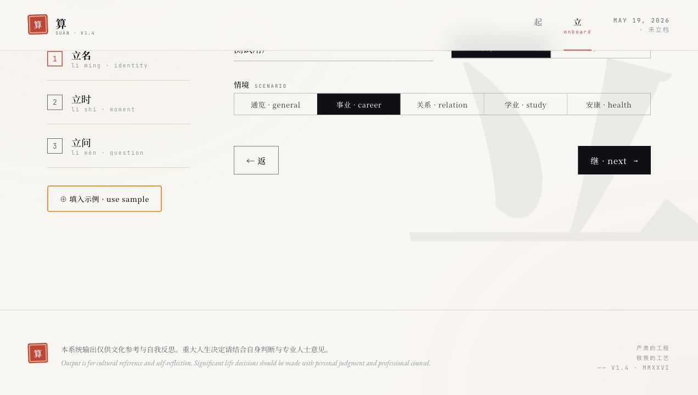
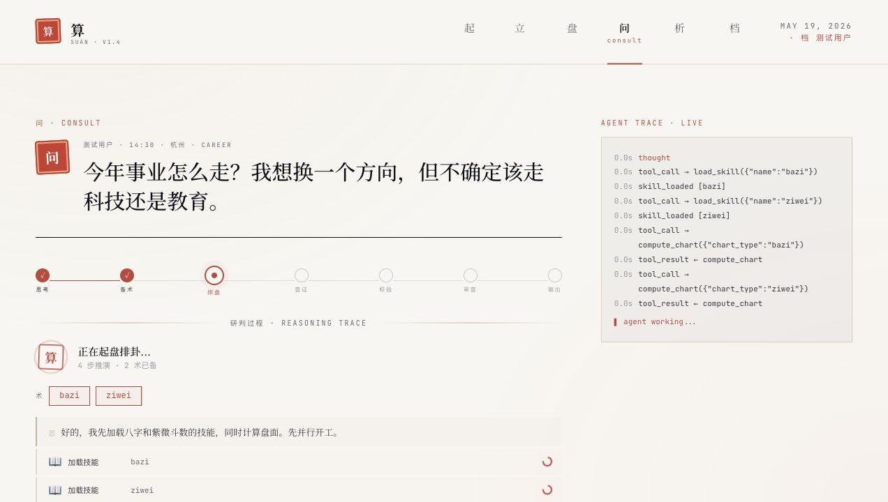

# 算 suan · 中西命理 AI Agent

> 一个 LLM，九个工具，九套技能。不是流水线，是真正的 agent。

## 使用截图

以下截图均使用匿名测试档案（`测试用户`），不包含真实姓名或个人信息。







## 架构

**单 Agent ReAct 循环** — 一个 LLM 自主决定：加载哪些技能、算哪些盘、查哪些典籍、怎么交叉验证、什么时候输出。

```
用户问题
  ↓
[LLM 思考] → 需要八字 + 占星
  ↓
load_skill("bazi")     → 学会八字方法论
load_skill("astrology") → 学会占星方法论
compute_chart("bazi")  → 四柱数据
compute_chart("natal_astro") → 行星数据
grep_classics("七杀|驿马") → 找到引证
read_classic("ziping_zhenquan_p072") → 读全文
verify_chart_ref("bazi.day_master", "辛") → ✓
  ↓
load_skill("cross_synthesis") → 交叉比对
apply_safety(final_text)      → 合规审查
  ↓
输出 1200 字综合研判（流式 SSE）
```

没有 planner / expert / synth / aligner / judge 这些角色。
一个 agent，自己想，自己查，自己写。

## 目录

```
agents/
  agent.py          ReAct 主循环（单 LLM + tool dispatch）
  tools.py          9 个工具实现 + JSON Schema
  safety.py         合规红线检查（regex，不走 LLM）

skills/             按需加载的方法论（Anthropic Skills 模式）
  bazi/SKILL.md     子平派八字
  ziwei/SKILL.md    紫微斗数
  astrology/SKILL.md 西洋占星
  yijing/SKILL.md   梅花易数
  tarot/SKILL.md    塔罗牌
  numerology/SKILL.md 数字命理
  fengshui/SKILL.md 玄空飞星风水
  cross_synthesis/SKILL.md 跨体系综合
  safety_psych/SKILL.md    心理安全

computation/        纯 Python 排盘引擎（不走 LLM）
  bazi.py           八字（农历/节气/真太阳时/干支/十神/神煞/大运）
  ziwei.py          紫微斗数
  astrology.py      占星（行星/宫位/相位）
  yijing.py         梅花易数
  tarot.py          塔罗
  numerology.py     数字命理
  fengshui.py       风水
  calendar.py       历法基础

knowledge/
  classics/*.md     81 篇命理典籍（YAML frontmatter + 正文）
  rules/*.md        61 条命理规则
  classics.json     原始 JSON（备份）
  rules.json        原始 JSON（备份）

core/
  config.py         环境配置（LLM_BASE_URL / LLM_API_KEY）
  llm_client.py     OpenAI 兼容 SDK 封装
  schemas.py        Pydantic 模型（BirthInfo + Charts）
  geo.py            地名→经纬度

api/routes.py       FastAPI 路由 + SSE
server.py           入口
web/v2.html         单文件 React SPA（Babel standalone）
```

## 工具

| 工具 | 用途 |
|------|------|
| `load_skill(name)` | 把技能方法论加进上下文 |
| `compute_chart(type)` | 跑纯 Python 排盘 |
| `grep_classics(pattern)` | ripgrep 搜索 81 篇典籍 |
| `read_classic(id)` | 读一篇典籍全文 |
| `grep_rules(pattern)` | ripgrep 搜索 61 条规则 |
| `read_rule(id)` | 读一条规则全文 |
| `verify_chart_ref(path, expected)` | 校验盘面引用防幻觉 |
| `apply_safety(text)` | 合规审查 |
| `ask_user(question)` | 阻塞等用户回复 |

## SSE 事件

| 事件 | 含义 |
|------|------|
| `thought` | agent 思考过程 |
| `tool_call` | 调用工具 |
| `tool_result` | 工具返回 |
| `skill_loaded` | 加载了技能 |
| `ask_user` | 需要用户补充 |
| `text_delta` | 最终文本流式片段 |
| `done` | 结束 |
| `error` | 出错 |

## 启动

```bash
# .env
LLM_BASE_URL=https://api.deepseek.com
LLM_API_KEY=sk-xxx

# 运行
python3 server.py
# → http://127.0.0.1:8765
```

依赖：`pip install fastapi uvicorn openai pydantic aiosqlite`

系统依赖：`brew install ripgrep`（用于典籍/规则搜索）

## 设计原则

1. **Agent not workflow** — LLM 自主决策，不是固定流水线
2. **Skills teach tools** — 技能教 LLM 怎么用工具，而不是替代 LLM 思考
3. **ripgrep > embeddings** — 小语料用 grep 比 BM25/embedding 更直接
4. **verify before cite** — 每个盘面引用必须 verify_chart_ref，防幻觉
5. **safety as tool** — 合规检查是工具不是 LLM，regex 不会出错
